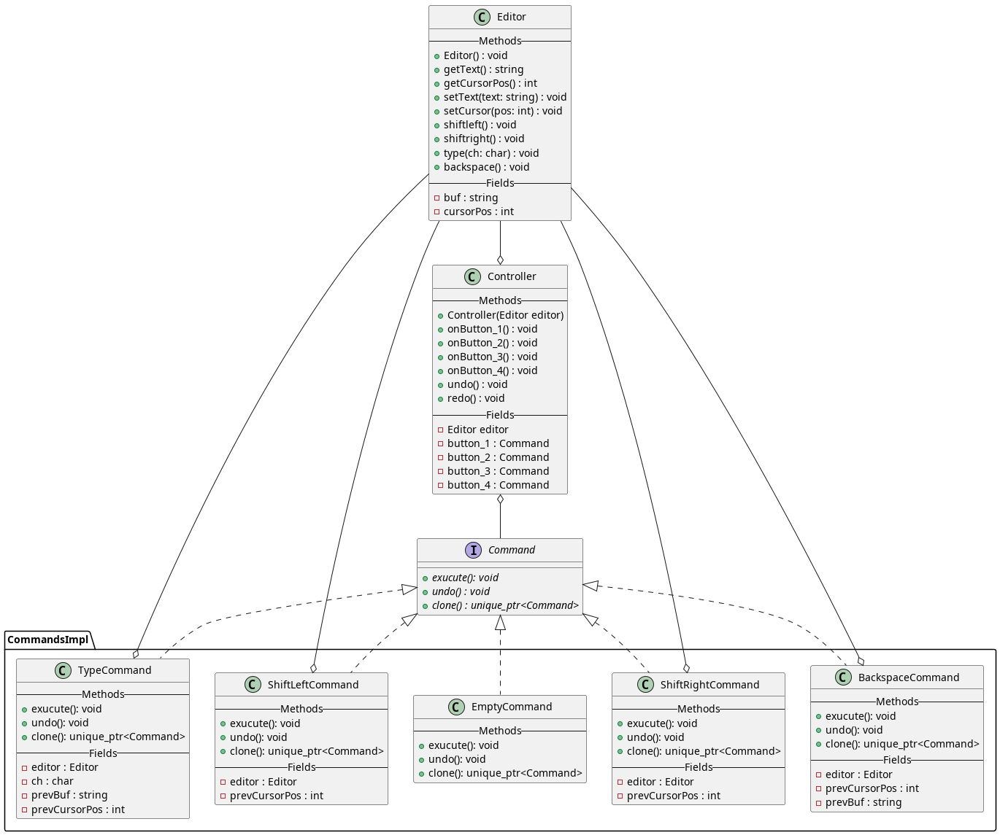

### 
Паттерн команда

Суть - инкапсулирует запрос в объекте, позволяя тем самым параметризировать клиента для разных запросов, ставить запросы в очередь или протоколировать их, а так же поддерживать операцию отмену(лучше и не описать)

