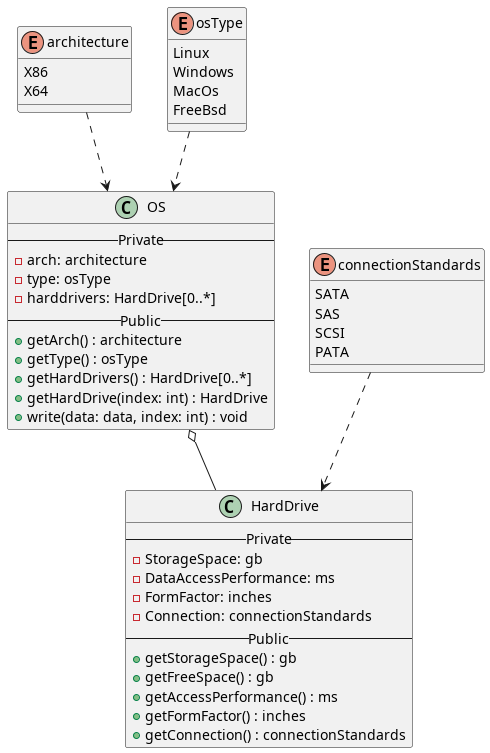
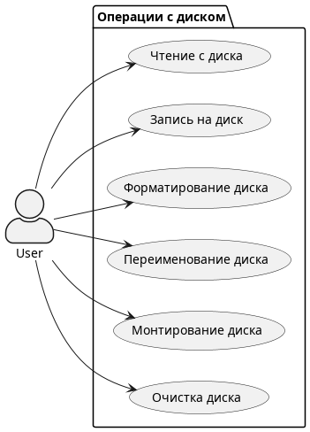
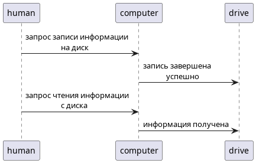
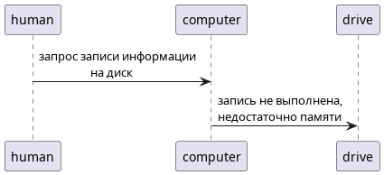
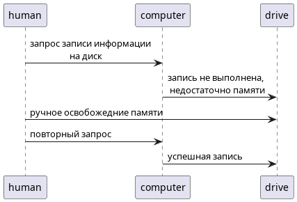
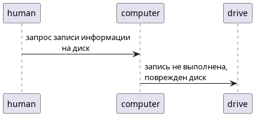
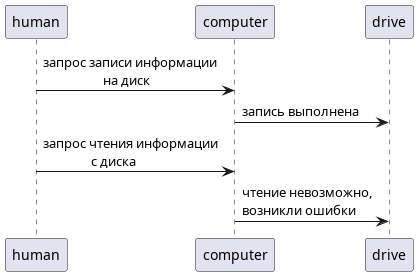

## 
Лабораторная работа 1

### Диаграмма классов:

### Диаграмма прецедентов:

### Диаграмма последовательностей для записи на диск

Для того, чтобы отобразить все перечисленные варианты я создал sequance диаграммы, для каждого отдельного случая

- Запись на диск и верификация успешны:
     
     

- Запись на диск не выполнена, недостаточно места:
     
     

- Запись на диск не выполнена, недостаточно места, но после финализации запись успешно выполнена:
     
     

- Запись на диск не выполнена, диск поврежден:
     
     

- Запись на диск выполнена, но верификация показала ошибки:
     
     
     
